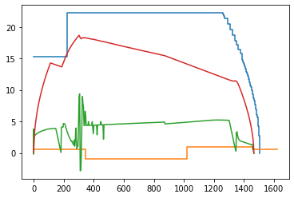

# xgboostTrain_accuracyStop
基于Xgboost算法的列车节能控制      Subway Train Energy Saving Control Based on Xgboost Algorithm

## 简介

列车节能控制仿真程序由列车控制指令生成算法和列车运行环境模拟算法两部分组成。类似于RL中的agent和environment的关系。

本程序将列车控制器看成一个智能的agent，可以输出牵引、制动、惰行指令。地铁环境仿真模块则考虑列车的动力学特性和线路条件，将输出指令转换成列车的加速度，从而由列车t时刻的状态计算得到t+1时刻的状态。

仿真程序可以根据线路条件、列车的动力学特性，计算出某条速度曲线下的牵引能耗。

在智能agent中，可以选择多种控制算法生成控制指令序列，如PID算法、专家系统、xgboost算法和强化学习。

Xgboost算法是一种集成分类树算法。Xbgboost算法通过学习历史的驾驶数据获得有经验的控制模型，控制列车在120s运行时间要求下的速度曲线如图所示，一般列车的质量为200t，计算得到耗能11.35Kwh。

## 使用说明

RunSimulation.py 是仿真系统的入口，仿真运行的循环过程。

在atoController.py中定义了几种ATO控制算法的实现。

在subway_system文件夹下的python文件是地铁环境的仿真接口：

TrainAndRoadCharacter.py提供线路的相关信息，如线路起点和终点、限速、坡度信息。

trainRunningModel.py提供的列车动力学模型，如最大牵引力限制和最大制动力限制。

matlab_plot 中包含matlab读取实验数据并且绘图的代码。

在xgboost_algorithm文件夹下保存的是Xgboost算法的训练数据、训练算法和训练得到模型。所以运行基于xgboost算法的ATO时会加载该文件夹下的模型。

注意：由于运行不同的文件时Python工作区间不同，而且读取数据文件时采用相对路径。偶尔会存在FileNotFoundError报错，需要根据运行python文件的位置调整数据文件路径。

## 环境配置

在Anaconda开发环境下运行。

需要安装xgboost模块、numpy模块和pandas模块。

## 推荐资料

陈德旺. 城轨列车智能驾驶的优化模型及算法[M]. 北京交通大学出版社, 2014.

